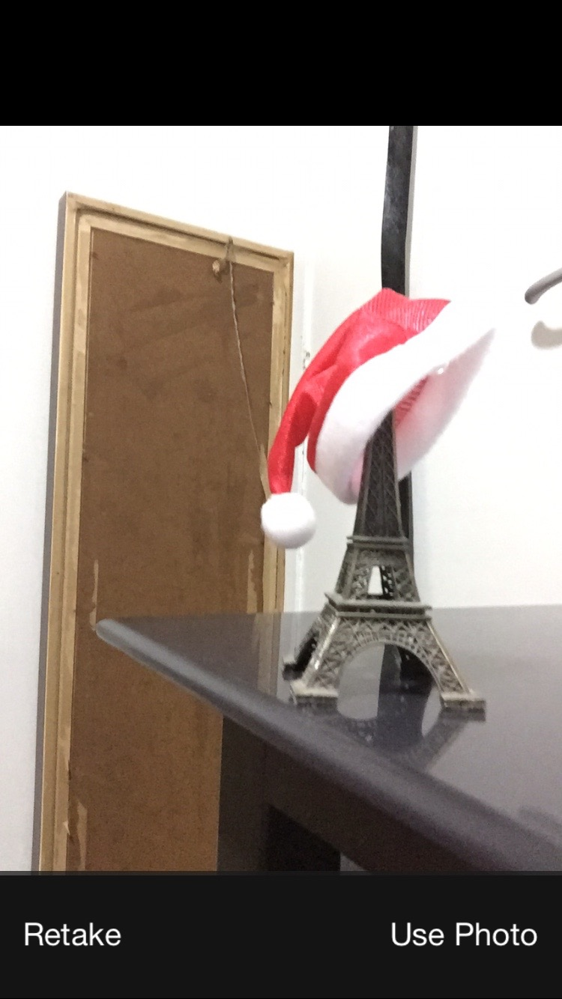
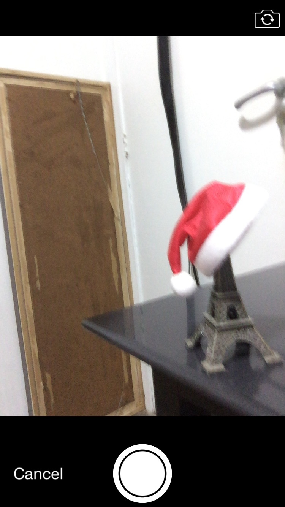
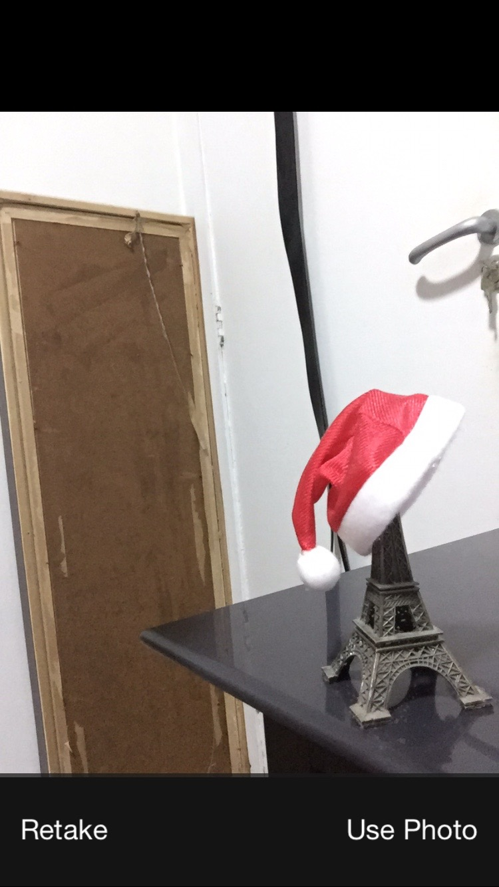

LEMirroredImagePicker
===========

## What is this

When using the `UIImagePickerController`, some of you must have noticed that, by default, the photo taken by the front camera is mirrored.

And even if you just invert the image taken in the delegate, the image displayed as preview by the `UIImagePickerController` will be still mirrored, resulting in a odd experience by the user.

See the example of UIImagePickerController's default front camera photo below:

<p align="center">


</p>

And now used together with the LEMirroredImagePicker:

<p align="center">


</p>

## Install

#### Manually

Drag and copy the two files in the [__LEMirroredImagePicker__](Pod/Classes) folder into your project, or add it as a git submodule.

#### Cocoapods

`LEMirroredImagePicker` is available through [CocoaPods](http://cocoapods.org). To install
it, simply add the following line to your Podfile:

```ruby
pod "LEMirroredImagePicker"
```

## How to use

`LEMirroredImagePicker` is ridiculously easy to use. All you need to do is invoke the two lines of code below:

```objective-c
#import "LEMirroredImagePicker.h"

(..)
@property(nonatomic) LEMirroredImagePicker *mirrorFrontPicker;
(..)

self.mirrorFrontPicker = [[LEMirroredImagePicker alloc] initWithImagePicker:pickerController];
[self.mirrorFrontPicker mirrorFrontCamera];

(..)
```

And thats it. Now the images taken by the front camera shown in the preview will be equal the ones the saw in the camera. See a complete example, with the `UIImagePickerController`, below:


```objective-c
UIImagePickerController *pickerController = [UIImagePickerController new];
pickerController.delegate = self;

if ([UIImagePickerController isSourceTypeAvailable:UIImagePickerControllerSourceTypeCamera])
{
    pickerController.sourceType = UIImagePickerControllerSourceTypeCamera;
    pickerController.cameraDevice = UIImagePickerControllerCameraDeviceFront;
}
else
{
    pickerController.sourceType = UIImagePickerControllerSourceTypePhotoLibrary;
}

self.mirrorFrontPicker = [[LEMirroredImagePicker alloc] initWithImagePicker:pickerController];
[self.mirrorFrontPicker mirrorFrontCamera];

[self presentViewController:pickerController animated:YES completion:nil];
```


## Collaborate
Liked the project? Is there something missing or that could be better? Feel free to contribute :)

1. Fork it

2. Create your branch
``` git checkout -b name-your-feature ```

3. Commit it
``` git commit -m 'the difference' ```

4. Push it
``` git push origin name-your-feature ```

5. Create a Pull Request


## Author

Lucas Eduardo, lucasecf@gmail.com

## License

LEMirroredImagePicker is available under the MIT license. See the LICENSE file for more info.
